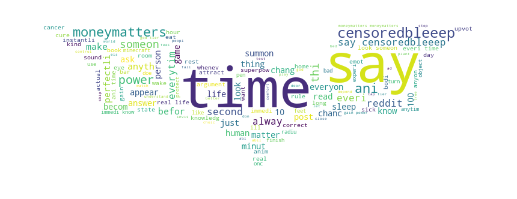
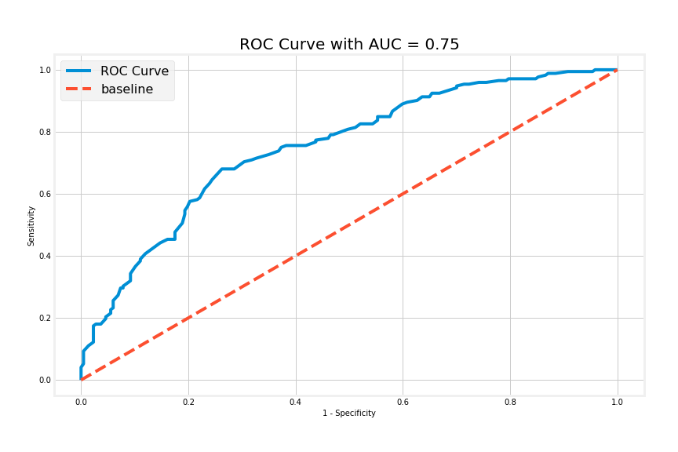
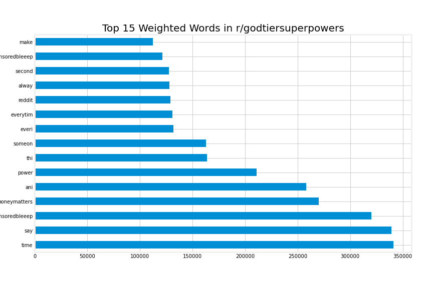
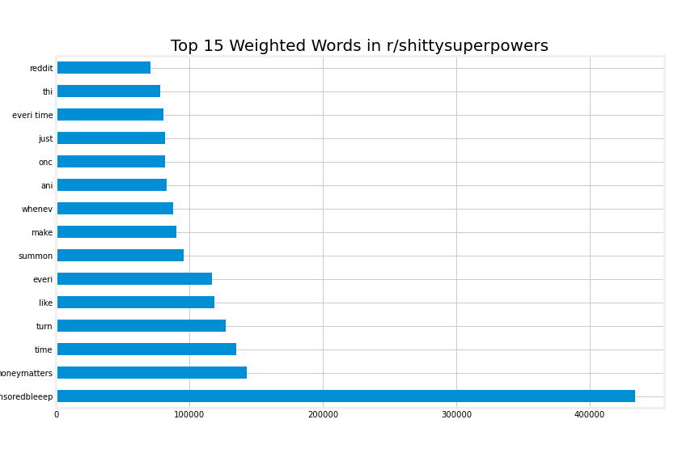

#  Project 3: Satirising Superpowers

### Overview

Superpowers. They do not exist. Yet, we are furious in our debates of them and relentless in our imaginings. No where else is this more evident than on reddit, but with a twist. Redditors have taken to the internet to satirise superpowers in subreddits r/shittysuperpowers and r/godtiersuperpowers, superpowers that no one could achieve. These are not to be powers of great super human feats. They can be, but that would be beside the point. Rather, they are superpowers that are very much rooted in the imaginings of a human world solving very human problems (often times simply inconveniences). They are superpowers that make you ask, "But, why?". These are superpowers that are anti-thetical to the movie superhero genre. When we mock superpowers, we mock ourselves and our own predicaments.

This project endeavours to investigate the phenomenon of satirising superpowers in two subreddits (r/shittysuperpowers vs r/godtiersuperpowers), and to uncover what they reveal about the modern human psyche. These subreddits differ by how lousy (r/shittysuperpowers) or overpowered (r/godtiersuperpowers) the described superpower is. Shitty superpowers have unintended consequences whereas god-tier superpowers are likely to be consequence-free, even if trivial or seemingly meaningless for humour's sake.

Through exploration of the subreddits in tandem, we should expect to discover our day-to-day struggles and concerns, problems that are sometimes larger than each of us and often outside our control. It is because these problems are out of our hands that we fantasise and/or mock superpowers that can deal with them effectively and efficiently, no matter how trivial or laughable. By contrasting between key word features from the two subreddits, we can gain an insight into the sentiment of futility or hopefulness behind an identified problem.

Thus, our hypothesis comes in two folds. The first, that both subreddits address in common certain root problems that the described superpowers wishes to tackle. The second, that r/shittysuperpowers (because of its implied consequences that comes with its superpowers) tackle themes/problems that are perceived as generally futile and too big to solve, whereas r/godtiersuperpowers (because of the implied lack of consequences of its superpowers) tackle themes/problems that are perceived more hopefully with an optimism for an eventual positive outcome.

---

### Executive Summary

Please use the following links to get around:

- [Executive Summary](#Executive-Summary)
- [Datasets](#Datasets)
- [Analysis and Evaluation](#Analysis-and-Evaluation)
- [Conclusions](#Conclusions)

The codes in this project are split across three notebooks - **"01_Superpowers_Scrape.ipynb"**, **"02_Superpowers_Data.ipynb"**, **"03_Superpowers_Model.ipynb"**. A total of 4 models were built iteratively to improve upon the classifier. There are different strategies to improve the model employed at each step of the way, and you should expect to toggle frequently between the Data notebook and the Model notebook. Each model is clearly numbered and its features are cleaned/engineered in the Data notebook before exporting for modelling in the Model notebook.

The data science process begins in the Scrape notebook. As an NLP (Natural Language Processing) project, we seek to provide answers for the above problem statement through the use of classification algorithms trained on word features. To acquire the data from r/shittysuperpowers and r/godtiersuperpowers, we had to scrape through the Reddit API with the use of a simple `requests` module. After we have gathered enough data, the data was saved into CSV files for use in the Data and Model notebooks.

In the Data notebook, we performed features cleaning, EDA, features selection and/or engineering. Analysis of word features in each subreddits are mostly conducted through the use of `WordCloud` and the occasional bar charts and scatter plots. Word features are iteratively improved upon through simplification strategies with each new model.

In the Code notebook, we performed all modelling and metrics evaluation. The process is largely the same with each models. Merged dataset imported would have to be split into training and unseen test set. Cross-validation methods are employed to evaluate the type of vectorizer (either `CountVectorizer` or `TfidfVectorizer`) and classifier (a custom function was written to test cross-validate `LogisticRegression`, `MultinomialNB`, and `KNeighborsClassifier` classifiers) to use. Once vectorizer and classifier is selected, hyper parameters are tuned using a combination of `Pipeline` and `GridSearchCV`. The final model is then trained again using the best hyper parameters and on the full training set without need for cross-validation anymore.

After final model has been built, we then score the model according to a few metrics. Since it would be equally bad to misclassify for r/shittysuperpowers as it would be to misclassify r/godtiersuperpowers, our main focus is on improving our accuracy score as well as minimising the gap in scores between training accuracy and test accuracy to improve generalisation of model. It begins with a baseline accuracy of 50.4% calculated from the proportion of r/shittysuperpowers class in our training set. The whole process repeats itself again and iterates for as many times as is necessary to build a satisfactory classifier model.

---

### Datasets

[Back to Top!](#Executive-Summary)

#### Scraped Data

This project scrapes the data required from reddit using the Python `requests` library. You may visit r/shittysuperpowers [here](https://www.reddit.com/r/shittysuperpowers/) and r/godtiersuperpowers [here](https://www.reddit.com/r/godtiersuperpowers/). Subreddits have their own rules governing their community and it would be worthwhile to read them to understand the subreddit community.

Collapsed below are the rulesets for both subreddits in question.
 
 

Rules for r/shittysuperpowers

||rule|
r/shittysuperpowers*
|
|:--:|:--|:--|
|01|Only shitty superpowers.|For some reason this has been a problem before. Dont post videos of people riding in shopping carts. or anything that isnt a superpower.|
|02|Control.|Power must have some form of agency. It can't just be things happening.|
|03|Start it off.|Please begin all posts with some form of introduction. "You can," "The ability to," etc|
|04|No caveats.|No posting powers that rely on a single bad thing that completely ruins the power. Ex: You can fly, but only at night.|
|05|No reposts.|Obviously your superpowers have to be unique and new. Don't say anything that has been said before.|
|06|No image posts.|Only text posts are allowed from here on out. If you have a visual diagram of any kind to give, feel free to give it in the comments. All image posts will be removed.|
|07|Low effort vulgarity.|Topics such as sex, genitals, and bodily functions will be tolerated provided they are clever and adhere to the other rules. Low effort posts that only exist to be vulgar will be removed.|
|08|No curses.|It's your super power, not something external happening to you. Most of these start off "every time you X, Y happens" or "whenever X, Y"|
|09|No karma or award farming.|This basically means that posts referencing awards, karma, or cake days are not allowed.|

*Source: https://www.reddit.com/r/shittysuperpowers/

Rules for r/godtiersuperpowers

||rule|
r/godtiersuperpowers*
|
|:--:|:--|:--|
|01|Maintain sub spirit.|Things that aren't actually overpowered, but are funny so we pretend they are overpowered was the start of this sub, let's keep that here. Additionally, creative powers, like finding a way the above not-very-good power could actually be god tier, are at the heart of the sub. Also take note: Unless a post has an award on it, no matter how many upvotes, I will delete it if it breaks the rules.
|02|Avoid overdone powers.|Read "Overdone Power List" to know in full, but avoid powers that have been done a million times.|
|03|No reposts.|Mostly you can just read the "Avoid overdone powers" rule, but yeah, don't repost things.|
|04|No venting powers.|Things like "you don't get [treated badly] by [person] like jeez brenda"|
|05|Overdone Power List.|Includes:<ul><li>Most forms of teleportation, especially "fast-travel" type powers.</li><li>"You literally are god/you are omnipotent" haha guys get it its funny because the sub is godteirsuperpowr! and power literaly make you god! funy!</li><li>Quicksaves. Do you really think that hasn't been done before?</li><li>Activates with finger guns/snapping: It's GODTIERsuperpowers, it's been done a million times before. Just have it at will.</li><li>"You get all the powers on this sub"</li><li>Upvotes on cakeday</li><li>59 second noodles</li><li>Kobe/Yeet for accuracy/power of throws</li></ul>|
    

*Source: https://www.reddit.com/r/godtiersuperpowers/

Posts were specifically scraped from the subreddit's Top of all time page. This reduces the likelihood of duplicate posts as it is unlikely that a new post make it to Top of all time during our scrape. It is also helpful to only scrape posts that are highly voted within its subreddit as they are most likely to be representative of the subreddit. Scraped data are saved in the `datasets` folder.

There are more datasets in the folder that have been created after data cleaning and features selection/engineering. These form the base for the different models in the model notebook.

#### Data Dictionary

This data dictionary only include features that are relevant to our analysis and modelling process

|Feature|Format|Type|Description|
|---|---|---|---|
|**subreddit**|*str*|Nominal|Subreddit of each post, and our target variable.|
|**is_shitty**|*integer*|Discrete|Dummy variable of the "subreddit" feature, and our target variable.|
|**ups**|*integer*|Discrete|Number of upvotes for each post.|
|**upvote_ratio**|*integer*|Discrete|Ratio of upvotes to total votes for each post.|
|**total_awards_received**|*integer*|Discrete|Total number of awards post received|
|**num_comments**|*integer*|Discrete|Total number of comments post attracted.|
|**over_18**|*bool*|Discrete|True if post is tagged as NSFW; False otherwise.|
|**is_over_18**|*integer*|Discrete|1 if post is tagged NSFW; 0 otherwise.|
|**num_comments**|*integer*|Discrete|Total number of comments post attracted.|
|**created**|*float*|Continuous|Unix time when post was created.|
|**pacific_st_created**|*Timestamp*|Continuous|Unix time of posts' creation converted to pandas Timestamp object.|
|**time_of_day**|*str*|Nominal|Split posts by the time of day (4 parts to a day) posts were created.|
|**title**|*str*|Nominal|Title of each post.|
|**title_censored**|*str*|Nominal|Title of each post after removing NSFW words.|
|**title_tokens**|*list*|Nominal|List of strings after tokenising each post title to keep some special characters and drop all others with `RegexpTokenizer`.|
|**title_tokens_str**|*str*|Nominal|Concatenated string of list of string from "title_tokens"|
|**title_tokens_lemm**|*str*|Nominal|Title of each post after regex tokenising and lemmatising with `WordNetLemmatizer`.|
|**title_tokens_stem**|*str*|Nominal|Title of each post after regex tokenising and stemming with `PorterStemmer` and subsequently substituting all references to money with a single word feature.|
|**title_stem_weight**|*str*|Nominal|Weighted title of each post by multiplying title and joining them for as many times as there are upvotes.|

---

### Analysis and Evaluation

[Back to Top!](#Executive-Summary)

#### Stemming and Features Engineering

    
For an NLP project, it was vital to simplify our word features for our model to train on. This was best done with `PorterStemmer`. Two new word features were also created for practical reasons (to keep our notebook SFW) and because they have been spotted as a recurring theme. These are "censoredbleeep" that replaced any and all offensive words, and "moneymatters" which replaces all references to money including numerals. Subsequently, these two features were found to make up a substantial composition of both subreddits. Finally, the count of the word features were also weighted according to the respective number of upvotes on each post.

#### Final Model

|Model No.|Training Accuracy|Test Accuracy|Score Gap|Recall|Specificity|ROC-AUC|
|---|---|---|---|---|---|---|
|None|-|0.504|-|-|-|-|
|01|0.744|0.634|0.110|0.699|0.583|0.677|
|02|0.729|0.659|0.070|0.645|0.670|0.709|
|03|0.708|0.674|0.033|0.692|0.661|0.720|
|04_1|0.708|0.674|0.034|-|-|-|
|04_2|0.738|0.812|-0.075|-|-|-|
|04|-|0.694|-|0.692|0.696|0.750|

Through the iterative process of improving our model either via its features or with the choice of algorithm, 4 models were created and evaluated. As we can observe, though the improvement from model to model is slight, the final model performs 19% better than the baseline accuracy.

Shown above is the ROC-AUC of our final model 04. It is a hybrid model - one part a `MultinomialNB` classifier (similar to Model 03) trained on the word features; another a `LogisticRegression` model trained on selected features. The mean of the final predicted probabilities from each model were then aggregated to generate predictions using their mean probability.

---

### Conclusions

[Back to Top!](#Executive-Summary)

We can observe from the bar chart above the top 15 word features by a weighted count. These word features were weighted according to the number of upvotes their respective posts garnered. We shall focus our attention on our two engineered feature words - "uncensoredbleeep" and "moneymatters". These word features are highly ranked among the two subreddits.

#### NSFW

For "censoredbleeep", this could mean any number of things. It could be something as trivial as swearing (to activate your powers) with/without consequences depending on the subreddit, to something as personal as sexual gratification/frustration, to even something political. The extracted posts listed below all have at least 10,000 upvotes each.

- r/godtiersuperpowers:
    - Saying "`censoredbleeep` it" just before making a decision will automatically yield the best outcome in the situation.
    - You have the power to successfully say “`censoredbleeep` the Chinese Government” on Reddit without getting removed.
    - Every time you get a random `censoredbleeep`, you get $100,000.

- r/shittysuperpowers:
    - You can tell if someone is your soulmate with 97% accuracy after having `censoredbleeep` with them on a weekly basis for 20 years.
    - Your `censoredbleeep` makes the Windows XP startup sound whenever you get an `censoredbleeep`.
    - Whenever you pee, you can rotate your `censoredbleeep` like a hose attachment to change the stream shape.
    
Through the lens of the second part of our hypothesis, it is interesting to see how NSFW posts differ from either subreddits. In r/godtiersuperpowers, you get a wide range of problems the superpowers attempts to solve - from ensuring always making the best decision, to political worries, to a trivial yet embarassing (if public) situation for any male. In contrast at r/shittysuperpowers, the problems the superpowers aim to solve border more on the banal everyday problems that are either annoying (such as the malfunction in the male restroom) or existential (for example the search for a soulmate) after some time.

Therefore, while in common both subreddits are heavily concerned about certain NSFW aspects of life, r/shittysuperpowers revealed to us that the mundane NSFW aspects of life are problems perceived as without much of a viable solution. In contrast, r/godtiersuperpowers reveals to us that certain redditors still hold out hope, for the banality of life and for political change.

#### Money

On the other hand, "moneymatters" is substituted everytime there is a reference to money. It could be a numeral prefixed with the dollar sign "$", or any vocabulary that refers to money and finance.

- r/godtiersuperpowers:
    - When you get your paycheck you can watch an ad to double it.
    - You can convert video game money into real money, whilst keeping the money in the game.
    - Every year, on your birthday, the worth of your weight in gold will be added to your bank account.

- r/shittysuperpowers:
    - You always have enough cash in your pocket for your change to be \$420.69.
    - Every time you forget about this power, a bear enters the room and hands you \$150 in cash.
    - When you sneeze, £10 is added to your bank account, but you also slightly shit yourself.

Scenarios and problems that reference money are often more straightforward than NSFW posts. They often involve getting more money. In r/godtierpowers, these are superpowers with some qualifiers but essentially consequence-free and desirable. These would be the redditors with a more optimistic perspective of financial freedom. But the posts also speak to larger issues such as annoying ads in our heavily digitally-marketed world, or weight problems that could bring you more riches on your birthday. In r/shittysuperpowers, the consequences of the superpowers are often more annoying, which forces you to value the money gained against the inconvenience to decide if it is worth it. However, there are certain superpowers that go a bit deeper than just inconveniencing yourself. For example, the pre-requisite to forget you have a superpower to get free cash from a bear satirises someone living with Alzheimer's. Would he/she be happy with the free cash, or freak out when a bear hands him/her the free cash?

Therefore, moeny matters to both subreddits. However, the more perceptive redditors understands that there is no free lunch in the world and factors in the absured cost (from capitulating to ads or living with Alzheimer's) of getting that money. From these examples then, we can understand that redditors are still hopeful about issues such as becoming the product for marketing and data companies or health problems associated with weight, against the other side of the coin where redditors despair more over having enough cash/change and growing old with Alzheimer's.
    

 
 
 
Thank you for reading this far. You are awesome!